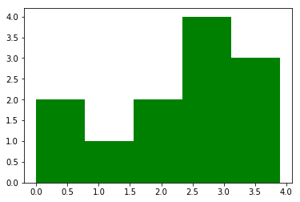

```python
import matplotlib.pyplot as plt
```


```python
# bins tells plt into how many bins data should be divided
# if you do not specify bins it will be 10 by default
# help(plt.hist)
```


```python
values = [0,0.5,1.4,1.6,2.2,2.5,2.6,3.2,3.5,3,3.9,2.6]
```


```python
plt.hist(values, bins=5, color='green')
```


    (array([ 2.,  1.,  2.,  4.,  3.]),
     array([ 0.  ,  0.78,  1.56,  2.34,  3.12,  3.9 ]),
     <a list of 5 Patch objects>)


```python
plt.show()
```





```python

```
