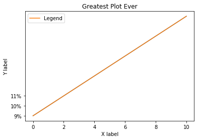

```python
# Import the necessary packages and modules
import matplotlib.pyplot as plt
import numpy as np
```


```python
# Prepare the data
# linespace returns evenly spaced numbers over a specified interval (start,stop, number of results)
x = np.linspace(0, 10,50)
x
```


    array([  0.        ,   0.20408163,   0.40816327,   0.6122449 ,
             0.81632653,   1.02040816,   1.2244898 ,   1.42857143,
             1.63265306,   1.83673469,   2.04081633,   2.24489796,
             2.44897959,   2.65306122,   2.85714286,   3.06122449,
             3.26530612,   3.46938776,   3.67346939,   3.87755102,
             4.08163265,   4.28571429,   4.48979592,   4.69387755,
             4.89795918,   5.10204082,   5.30612245,   5.51020408,
             5.71428571,   5.91836735,   6.12244898,   6.32653061,
             6.53061224,   6.73469388,   6.93877551,   7.14285714,
             7.34693878,   7.55102041,   7.75510204,   7.95918367,
             8.16326531,   8.36734694,   8.57142857,   8.7755102 ,
             8.97959184,   9.18367347,   9.3877551 ,   9.59183673,
             9.79591837,  10.        ])


```python
# Plot the data
plt.plot(x, x)
```


    [<matplotlib.lines.Line2D at 0x10deda630>]


```python
# lets customize our plot
plt.plot(x, x, label="Legend")
plt.legend()
plt.xlabel("X label")
plt.ylabel("Y label")
plt.title("Greatest Plot Ever")
# change Y ticks
# plt.yticks([-1,0,1,2,3,4,5,6,7,8,9,10,11])
# you can add labels t Y ticks
plt.yticks([0,1,2],['9%','10%','11%'])
plt.show()

```





```python

```
