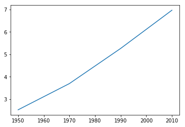
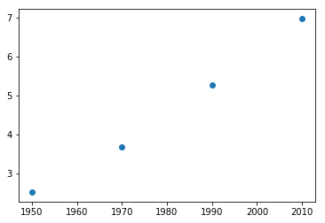
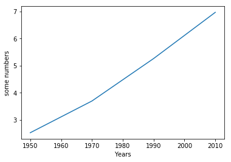

```python
import matplotlib.pyplot as plt
```


```python
year = [1950, 1970, 1990, 2010]
population = [2.519, 3.692, 5.263, 6.972]
# year is x and population is y
# plot shows what to plot and how to plot
plt.plot(year, population)
```


    [<matplotlib.lines.Line2D at 0x10dfcd748>]


```python
plt.show()
```





```python
# Scatter plot
plt.scatter(year, population)
plt.show()
```





```python
plt.plot(year, population)
plt.xlabel('Years')
plt.ylabel('some numbers')
plt.show()
```





```python

```
